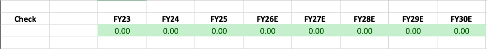
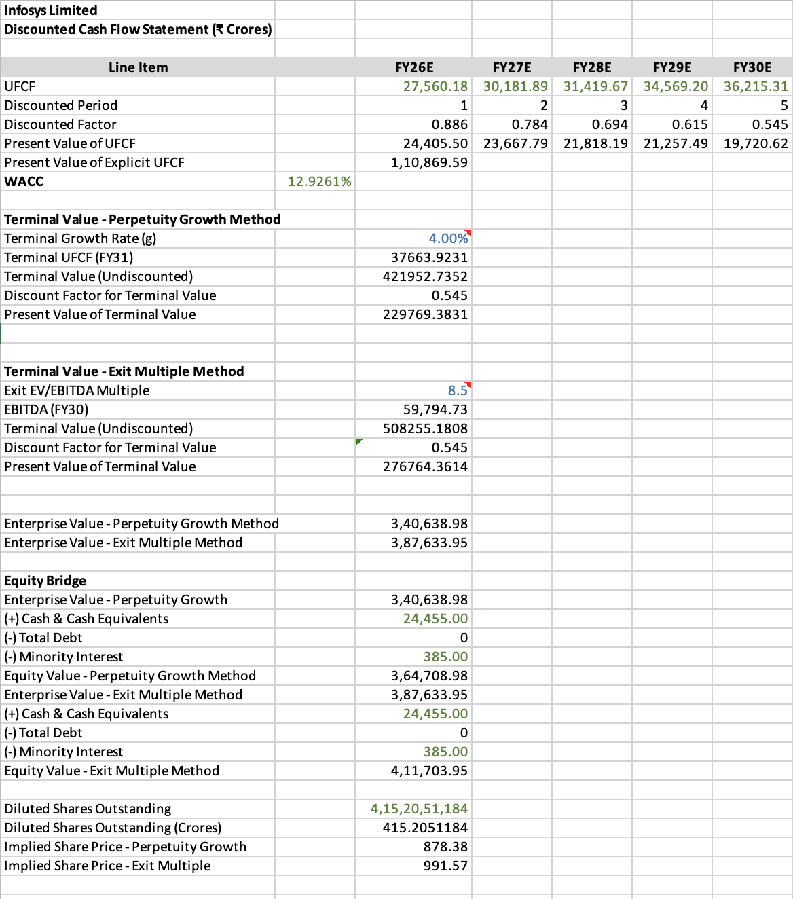
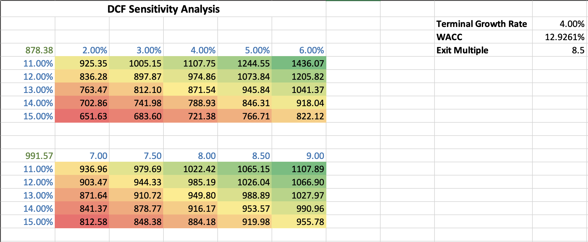

# Infosys Ltd — 3-Statement Operating Model & DCF Valuation

A fully integrated 3-statement financial model and discounted cash flow valuation for **Infosys Ltd (NSE: INFY)**, built from scratch in Excel using public consolidated financial statements (Ind-AS, ₹ Crores).

Built as an interview-preparation exercise for Investment Banking / Private Equity technical rounds — the goal was not just to produce a valuation output, but to construct every link between the Income Statement, Balance Sheet, and Cash Flow Statement manually, so the mechanics (and the failure modes) are fully understood rather than templated.

---

## 🔑 TL;DR

- Fully integrated 3-statement model (IS / BS / CFS) that **balances dynamically** across 3 historical years (FY23–FY25) and a 5-year forecast (FY26E–FY30E)
- PP&E and Working Capital schedules built as standalone rollforwards, not hardcoded into the statements
- WACC derived via CAPM (12.93%), feeding an Unlevered Free Cash Flow DCF
- Terminal Value calculated via **both** Perpetuity Growth and Exit Multiple methods, converging to a tight range
- 2D sensitivity tables (WACC × Terminal Growth, WACC × Exit Multiple)
- **Implied share price: ₹878.38 (Perpetuity Growth) / ₹991.57 (Exit Multiple)**


---

## Project structure

```
infosys-3-statement-dcf/
├── README.md
├── model/
│   └── 3 statement model .xlsx      ← the workbook
├── docs/
│   ├── phase1_historicals.md
│   ├── phase2_operating_drivers.md
│   ├── phase3_forecast_is_bs.md
│   ├── phase4_cash_flow_statement.md
│   ├── phase5_ufcf_wacc.md
│   ├── phase6_terminal_value_dcf.md
│   ├── phase7_sensitivity_analysis.md
│   └── debugging_log.md                 ← real bugs found & fixed, see below
├── sources/
│   └── source_links.md                  ← links to filings used (no PDFs committed)
└── screenshots/
    ├── check_tab_balanced.png
    ├── dcf_output.png
    └── sensitivity_table.png
```

## Tab structure inside the workbook

| Tab | Purpose |
|---|---|
| `Cover` | Title, navigation |
| `Assumptions` | All operating drivers — revenue growth, margins, WC days, capex %, WACC inputs |
| `IS` / `BS` / `CFS` | Historical (FY23–FY25) and forecast (FY26E–FY30E) statements |
| `Check` | Balance sheet integrity check — Assets vs. Liabilities + Equity, every year |
| `PP&E Sch` | Gross PP&E / Accumulated Depreciation / Net PP&E rollforward |
| `WC Sch` | Receivables / Payables / Inventory built from DSO / DPO / DIO |
| `WACC` | CAPM cost of equity, after-tax cost of debt, blended WACC |
| `UFCF` | Unlevered free cash flow build (NOPAT + D&A − Capex − ΔNWC) |
| `DCF` | Discounting, terminal value (both methods), equity bridge, implied share price |
| `Sensitivity` | 2D data tables, WACC vs. terminal growth / exit multiple |

**Color convention used throughout:** 🔵 Blue = hardcoded input · ⚫ Black = same-sheet formula · 🟢 Green = cross-tab link

---

## Balance Sheet integrity — Check tab

The model balances genuinely (Total Assets = Total Liabilities + Equity) across all 3 historical years and all 5 forecast years — not via a plug, and not via a false-positive formula (see `debugging_log.md` for a bug where an earlier version of this check was silently comparing blank cells).



## DCF output

UFCF is discounted at a WACC of 12.93% (CAPM, domestic beta), with Terminal Value calculated two ways — Perpetuity Growth and Exit Multiple — bridged from Enterprise Value to an implied per-share price using FY25 actuals for cash, debt, and minority interest.



## Sensitivity analysis

Both 2D data tables (WACC × Terminal Growth Rate, WACC × Exit Multiple) show the implied share price across a realistic assumption range, with the base case sitting near the center of each grid.



---

## Methodology notes

**Why Infosys?** Asset-light, single-segment IT services business with minimal debt — chosen deliberately to isolate the *mechanics* of a 3-statement build (integration, dynamic balancing, schedule construction) from the complexity of a multi-segment or highly levered business.

**Key simplifications, stated explicitly (not oversights):**
- No circularity/debt-revolver mechanism — Infosys is a net-cash business, so this wasn't material enough to justify the added complexity for a first build
- Deferred tax assets/liabilities and lease liabilities held flat across the forecast, rather than separately scheduled
- Valuation date assumed at the start of FY26 (no mid-year discounting convention applied)

Full phase-by-phase reasoning — including *why* each formula was built the way it was — is documented in [`/docs`](./docs).

## Debugging & audit trail

A working model isn't the interesting part — how it got debugged is. [`docs/debugging_log.md`](./docs/debugging_log.md) documents several real integration bugs found and fixed during the build, including a false-positive Check tab formula, a double-counting error in Total Equity, a frozen forecast formula, and a ₹1,708 Cr historical PP&E transcription error traced back to the FY25 Annual Report and corrected at the source.

## Sources

All historical financials sourced from Infosys's Integrated Annual Reports (Consolidated financials, Ind-AS). WACC inputs (risk-free rate, beta, equity risk premium) sourced from public market data. See [`sources/source_links.md`](./sources/source_links.md) for direct links. Filing PDFs are not committed to this repo (see `.gitignore`) — this is someone else's copyrighted document; the repo links to it instead.

## Status

All 7 phases complete — Setup & Historicals → Operating Drivers → IS/BS Forecast → Cash Flow Statement → UFCF & WACC → Terminal Value & Equity Bridge → Sensitivity Analysis

---

*Built as part of IB/PE project. Not investment advice.*